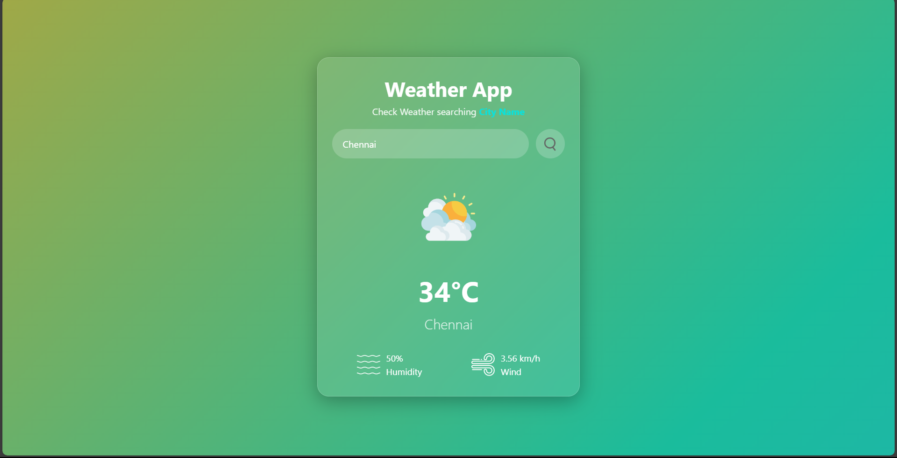

# 🌦️ Weather App

A simple weather forecast web app built using HTML, CSS, and JavaScript.  
It fetches real-time weather data using the OpenWeatherMap API.

---

## 🚀 Features

- Get current temperature, humidity, and wind speed
- Beautiful, responsive UI
- Weather icon changes based on conditions
- City name search
- Real-time updates via API

---

## 🔧 Tech Stack

- HTML5
- CSS3
- JavaScript (Vanilla)
- OpenWeatherMap API

---

## 📸 Preview
 



---

## 🔑 How to Use

This app requires your own API key from [OpenWeatherMap](https://home.openweathermap.org/users/sign_up) to work.  
For security reasons, the key is not included in this repository.

### 🛠️ Steps to Set It Up:

1. Sign up at [OpenWeatherMap](https://home.openweathermap.org/users/sign_up)
2. Go to your account > API keys and copy your **API key**
3. In the root of this project, create a new file called `config.js`
4. Paste the following code inside `config.js`:

```js
// config.js
const WEATHER_API_KEY = "your_api_key_here";
const apiURL = "https://api.openweathermap.org/data/2.5/weather?";
